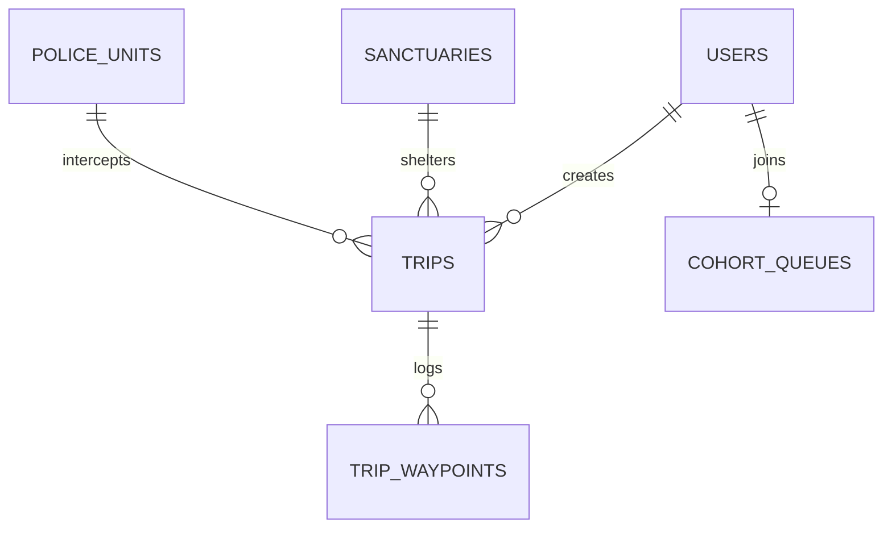

# AuraPath: Technical Architecture & System API Specification

This document details the production-ready database schema (Firebase Firestore) and the API specifications (REST/WebSocket) for the AuraPath Urban Safety Operating System.

---

## 💾 Firebase Firestore Database Design

AuraPath utilizes Firestore for its document-oriented database architecture, optimized for geospatial queries (via Geohashes) and low-latency client synchronizations.

### Collections & Documents Schema



#### 1. `users` Collection
*   **Path**: `/users/{userId}`
*   **Purpose**: Stores user profiles, verification records, and trust indices.
*   **Document Schema**:
    ```json
    {
      "userId": "usr_94382",
      "name": "Priya Sharma",
      "phone": "+919876543210",
      "email": "priya.sharma@domain.com",
      "avatarInitials": "PS",
      "kycStatus": "VERIFIED", // [PENDING, VERIFIED, REJECTED]
      "kycVerifiedAt": "2026-06-10T11:20:00Z",
      "emergencyContacts": [
        {
          "name": "Rajesh Sharma",
          "relation": "Father",
          "phone": "+919876543211"
        }
      ],
      "gaitDNAProfile": {
        "averageStepLength": 0.68, // in meters
        "averageFrequency": 1.9, // steps per second
        "baseDriftRate": 0.05
      },
      "createdAt": "2026-05-01T08:00:00Z"
    }
    ```

#### 2. `trips` Collection
*   **Path**: `/trips/{tripId}`
*   **Purpose**: Tracks live and historical commuter routes, telemetry, cohort associations, and risk ratings.
*   **Document Schema**:
    ```json
    {
      "tripId": "trip_b9843",
      "commuterId": "usr_94382",
      "status": "ACTIVE", // [INITIATED, ACTIVE, DEVATION_WARNING, EMERGENCY_TRIGGERED, COMPLETED, ABANDONED]
      "route": {
        "origin": { "lat": 12.9230, "lng": 77.6810, "name": "Metro Exit 4" },
        "destination": { "lat": 12.9225, "lng": 77.6750, "name": "Green Glen Home" },
        "plannedPolyline": "y}rnAq`vxMn@yE_@eA...",
        "uviScore": 0.91,
        "plannedETA": 22 // in minutes
      },
      "cohortId": "cohort_c7382", // null if walking alone
      "guardianNetwork": {
        "protectionScore": 0.96,
        "layersActive": ["CORRIDOR", "COHORTS", "SANCTUARIES", "POLICE"],
        "nearestSanctuaryId": "sanc_01",
        "nearestPatrolId": "patrol_04"
      },
      "biometrics": {
        "heartRateBpm": 76,
        "gaitSpeed": "NORMAL", // [NORMAL, FAST, IRREGULAR, STOPPED]
        "audioDb": 42
      },
      "deviationPercentage": 0.0,
      "riskLevel": "GREEN", // [GREEN, YELLOW, ORANGE, RED]
      "startedAt": "2026-06-15T19:15:00Z",
      "completedAt": null
    }
    ```

#### 3. `cohort_queues` Collection
*   **Path**: `/cohort_queues/{queueId}`
*   **Purpose**: Manages real-time WebSocket matching queues for commuters departing from the same hubs.
*   **Document Schema**:
    ```json
    {
      "queueId": "q_hub_metro_exit_4",
      "commuterId": "usr_94382",
      "location": { "lat": 12.9230, "lng": 77.6810, "geohash": "tdr1v7m" },
      "destinationCoords": { "lat": 12.9225, "lng": 77.6750 },
      "departureTimeThreshold": "2026-06-15T19:20:00Z",
      "joinedAt": "2026-06-15T19:12:00Z"
    }
    ```

#### 4. `sanctuaries` Collection
*   **Path**: `/sanctuaries/{sanctuaryId}`
*   **Purpose**: Manages merchant profiles, BLE beacon IDs, and protection capacities.
*   **Document Schema**:
    ```json
    {
      "sanctuaryId": "sanc_01",
      "name": "Ramesh Kirana Store",
      "type": "RETAIL_STORE", // [RETAIL_STORE, PHARMACY, POLICE_BOOTH, PETROL_STATION]
      "beaconNodeId": "beacon_node_01",
      "coordinates": { "lat": 12.9242, "lng": 77.6795, "geohash": "tdr1v7s" },
      "address": "Lane 4, Outer Ring Rd Junction",
      "trustRating": 4.9,
      "status": "ONLINE", // [ONLINE, ACTIVE_DEFENSE, OFFLINE]
      "contactPhone": "+919876543220",
      "lastPing": "2026-06-15T19:14:50Z"
    }
    ```

---

## 🔒 Firebase Security Rules

Ensures absolute privacy; commuters can only read their own telemetry, while municipal authority accounts are granted read privileges for emergency events.

```javascript
rules_version = '2';
service cloud.firestore {
  match /databases/{database}/documents {
    
    // User profile: only owned user can read/write
    match /users/{userId} {
      allow read, write: if request.auth != null && request.auth.uid == userId;
    }
    
    // Trips: owner can read/write. Police/Admin can read active emergencies.
    match /trips/{tripId} {
      allow create: if request.auth != null;
      allow read: if request.auth != null && 
        (resource.data.commuterId == request.auth.uid || 
         request.auth.token.role == 'MUNICIPAL_OFFICER');
      allow update: if request.auth != null && 
        (resource.data.commuterId == request.auth.uid || 
         request.auth.token.role == 'MUNICIPAL_OFFICER');
    }
    
    // Sanctuaries: readable by all authenticated; writeable only by merchant/admin
    match /sanctuaries/{sanctuaryId} {
      allow read: if request.auth != null;
      allow write: if request.auth != null && request.auth.token.role == 'MERCHANT_ADMIN';
    }
  }
}
```

---

## 📡 REST API Specifications

All REST endpoints require a Bearer JWT Auth Token issued by the Kong API Gateway and validate inputs using JSON Schema definitions.

### 1. Plan Route & Calculate UVI
*   **Endpoint**: `POST /api/v1/routes/plan`
*   **Auth**: Required (User JWT)
*   **Request Payload**:
    ```json
    {
      "origin": { "lat": 12.9230, "lng": 77.6810 },
      "destination": { "lat": 12.9225, "lng": 77.6750 }
    }
    ```
*   **Success Response (`200 OK`)**:
    ```json
    {
      "routes": [
        {
          "type": "SAFEST_CORRIDOR",
          "plannedPolyline": "y}rnAq`vxMn@yE_@eA...",
          "etaMinutes": 22,
          "distanceMeters": 980,
          "uviScore": 0.91,
          "breakdown": {
            "lightingScore": 0.95,
            "crowdActivity": 0.85,
            "storefrontActivity": 0.90,
            "transitPresence": 0.80,
            "historicalReports": 0.98
          },
          "reasoning": "Route routes along Outer Ring Road service lanes featuring high active lighting levels (95%), 8 registered active BLE stores, and regular police patrol beats."
        },
        {
          "type": "FASTEST_SPEED",
          "plannedPolyline": "s}rnAq`vxM_@qB_...",
          "etaMinutes": 18,
          "distanceMeters": 820,
          "uviScore": 0.62,
          "breakdown": {
            "lightingScore": 0.35,
            "crowdActivity": 0.40,
            "storefrontActivity": 0.30,
            "transitPresence": 0.90,
            "historicalReports": 0.70
          },
          "reasoning": "Saves 4 minutes, but routes commuter through unlit interior layouts with unmonitored blind spots."
        }
      ]
    }
    ```

### 2. Live Beacon Handshake & Sanctuary Check-In
*   **Endpoint**: `POST /api/v1/sanctuary/checkin`
*   **Auth**: Required (User JWT)
*   **Request Payload**:
    ```json
    {
      "tripId": "trip_b9843",
      "sanctuaryId": "sanc_01",
      "beaconNodeId": "beacon_node_01",
      "bleRssi": -58, // Received signal strength index
      "action": "LOCK_SHELTER" // [ENTER_RANGE, LOCK_SHELTER, EXIT_RANGE]
    }
    ```
*   **Success Response (`200 OK`)**:
    ```json
    {
      "status": "SUCCESS",
      "message": "Shelter in Sanctuary Ramesh Kirana Store locked. AWS IoT Broker alerted.",
      "activeSanctuary": {
        "sanctuaryId": "sanc_01",
        "ownerContact": "+919876543220",
        "cctvBroadcastActive": true
      }
    }
    ```

---

## 🔌 WebSocket Synced Real-Time API (WSS)

Low-latency connections are established using the Node.js WebSocket engine for live coordinate pairings, spatial trail monitoring, and anomaly updates.

### 1. Handshake Initiation
*   **URL**: `wss://api.aurapath.org/v1/trips/sync`
*   **Headers**: `Authorization: Bearer <JWT_TOKEN>`

### 2. Client-to-Server Telemetry Packet
Sent by the client app every 5 seconds (normal mode) or every 0.5 seconds (2Hz smart guardian fallback).
```json
{
  "event": "telemetry",
  "data": {
    "tripId": "trip_b9843",
    "location": { "lat": 12.9242, "lng": 77.6795, "bearing": 270, "speedMps": 1.2 },
    "biometrics": {
      "heartRateBpm": 76,
      "gaitStability": 0.94,
      "microphoneDb": 42
    }
  }
}
```

### 3. Server-to-Client Event Packet (Cohort Pairing Update)
Fired by the matching queue engine when another verified commuter matches path trajectories.
```json
{
  "event": "cohort_paired",
  "data": {
    "cohortId": "cohort_c7382",
    "partner": {
      "name": "Sarah M.",
      "avatarInitials": "SM",
      "kycStatus": "VERIFIED"
    },
    "matchingBubbleRadius": 1.5, // in meters
    "matchProbability": 0.98
  }
}
```

### 4. Server-to-Client Emergency Alarm Trigger
Fired when CommuteDNA logic registers a deviation without confirmation, forcing client to display the shield lock screen.
```json
{
  "event": "emergency_loop_deployed",
  "data": {
    "alertId": "alert_a8932",
    "status": "DISPATCHED",
    "policeUnit": {
      "unitId": "patrol_04",
      "officerName": "Inspector Kumar",
      "etaMinutes": 3
    }
  }
}
```
